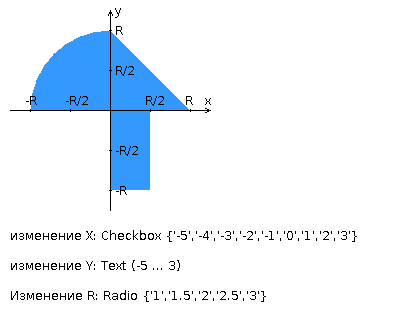

# Лабораторная работа № 1. Вариант 473

## Задание 
Разработать сервлет, определяющий попадание точки на координатной плоскости в заданную область и создать HTML-страницу, которая формирует данные для отправки их на обработку этим сервлетом.

Параметр R и координаты точки должны передаваться сервлету посредством HTTP-запроса по методу GET. Сервлет должен возвращать HTML-страницу с таблицей, содержащей полученные параметры и результат вычислений - факт попадания или непопадания точки в область.

**Разработанная HTML-страница должна содержать:**

1. "Шапку", содержащую ФИО студента, номер группы и номер варианта.
2. Форму, отправляющую данные на сервер.
3. Набор полей для задания координат точки и радиуса области в соответствии с вариантом задания.
4. Сценарий на языке JavaScript, осуществляющий валидацию значений, вводимых пользователем в поля формы. Любые некорректные значения (например, буквы в координатах точки или отрицательный радиус) должны блокироваться.
5. Каскадную таблицу стилей (CSS), устанавливающую размеры и позиционирование полей ввода.

Разработанные сервлет и HTML-страницу необходимо развернуть на сервере приложений GlassFish.

**Вопросы к защите лабораторной работы:**

1. Протокол HTTP. Особенности, типы запросов.
2. Java-сервлеты. Особенности реализации, ключевые методы. Контейнеры сервлетов.
3. Язык разметки HTML. Особенности, основные теги и атрибуты тегов.
4. Структура HTML-страницы. Объектная модель документа (DOM).
5. HTML-формы. Виды полей ввода. Задание метода HTTP-запроса.
6. Клиентские сценарии. Особенности, сферы применения. Язык JavaScript.
7. Синхронная и асинхронная обработка HTTP-запросов. AJAX.
8. Каскадные таблицы стилей (CSS). Особенности применения и преимущества перед непосредственным заданием стилей через атрибуты тегов.

## Структура проекта
`src/dno1/MainServlet.java` -- Сервлет, выдающий главную страницу проекта (/index.jsp).

`src/dno1/HandlerServlet.java` -- Сервлет, обрабатывающий запрос пользователя и выдающий или ошибку 400 (Bad Request), или валидную таблицу (/handle.jsp). Предполагается, что таблица будет встроена посредством ajax.

`web/index.jsp` — Представление главной страницы.

`web/handle.jsp` — Представление таблицы.

`web/js/main.js` — Основной контроллер проекта. Осуществляет валидацию формы и передачу ajax-запроса.

`web/js/problem_line.js` — Объект, осуществляющий управление строкой вывода ошибок. Содержит публичные методы:

	addMessage(name, message) — Добавляет в вывод ошибок сообщение с ключом name и текстом message.
	removeMessage(name) — Удаляет сообщение с ключом name.

`web/js/text_validator.js` — Осуществляет валидацию текстового поля. Содержит публичные методы:

	validate() — Возвращает код результата валидации.
	getMessage() — Возвращает сообщение об ошибке валидации.
	enable() — Включает слушатель изменения текстового поля.

`web/js/checkbox_validator.js` — Осуществляет валидацию чекбоксов. Валидация считается не пройденной, если не выбран ни один чекбокс. Публичный интерфейс идентичен таковому у TextValidator.

`web/css/style.css` — Таблица стилей для главной страницы.

`web/WEB-INF/web.xml` — Описание сервлетов, относящихся к ним классов и роутинг.

`web/WEB-INF/sun-javaxws.xml` — ХЗ.

`dno1.iml` — Тоже ХЗ. Судя по всему, конфигурационные данные веб-проекта.

## Дополнительная информация

Минутка рекламы. IntelliJ IDEA 13 — это нечто божественное. 12 тоже была очень хороша, но 13 будет не жалко купить со скидкой 75% хотя бы.