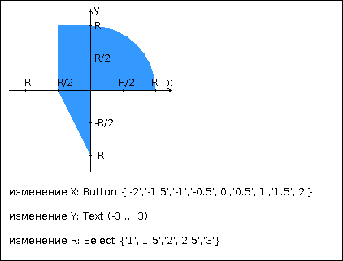

# Лабораторная работа № 2. Вариант 2068

## Задание 
Создать JSP-страницу, которая формирует HTTP-запрос на проверку попадания точки в заданную область на координатной плоскости и осуществляет обработку этого запроса.

**Разработанная HTML-страница должна содержать:**

1. "Шапку", содержащую ФИО студента, номер группы и номер варианта.
2. Форму, отправляющую данные на сервер. Форма должна использовать метод HTTP-запроса в соответствии с вариантом из работы №1.
3. Набор полей для задания координат точки и радиуса области в соответствии с вариантом задания.
4. Картинку, изображающую область на координатной плоскости в соответствии с номером варианта. Если радиус области установлен, клик курсором мыши по этой картинке должен обрабатываться Javascript-функцией, определяющей координаты точки, по которой кликнул пользователь. В противном случае, после клика по картинке должно выводиться сообщение о невозможности определения координат точки.
5. Код на языке Java, осуществляющий проверку попадания точки в область.
6. Таблицу со списком результатов предыдущих проверок.

Разработанную JSP-страницу необходимо развернуть на сервере приложений GlassFish.

**Вопросы к защите лабораторной работы:**

1. JavaServer Pages. Особенности, преимущества и недостатки по сравнению с сервлетами, область применения.
2. Жизненный цикл JSP.
3. Структура JSP-страницы. Комментарии, директивы, объявления, скриптлеты и выражения.
4. Правила записи Java-кода внутри JSP. Стандартные переменные, доступные в скриптлетах и выражениях.
5. Стандартные теги JSP. Использование Expression Language (EL) в JSP.
6. Параметры конфигурации JSP в дескрипторе развёртывания веб-приложения.