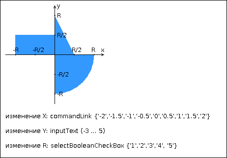

# Лабораторная работа № 3. Вариант 3013

## Задание 
Разработать приложение на базе JavaServer Faces Framework, которое осуществляет проверку попадания точки в заданную область на координатной плоскости.

Приложение должно включать в себя JSP-страницу и набор управляемых бинов (managed beans), реализующих логику на стороне сервера.

**Разработанная HTML-страница должна содержать:**

1. "Шапку", содержащую ФИО студента, номер группы и номер варианта.
2. Набор компонентов для задания координат точки и радиуса области (в соответствии с вариантом задания). Если компонент допускает ввод заведомо некорректных данных (таких, например, как буквы в координатах точки или отрицательный радиус), то приложение должно осуществлять их валидацию.
3. Динамически обновляемую картинку, изображающую область на координатной плоскости в соответствии с номером варианта и точки, координаты которых были заданы пользователем. Цвет точек должен зависить от факта попадания / непопадания в область.
4. Таблицу со списком результатов предыдущих проверок.

Разработанное приложение необходимо развернуть на сервере приложений GlassFish.

**Вопросы к защите лабораторной работы:**

1. Архитектура веб-приложений. Шаблон MVC. Model 1 и Model 2.
2. Технология JavaServer Faces. Особенности, отличия от сервлетов и JSP, преимущества и недостатки. Структура JSF-приложения.
3. Использование JSP-страниц в JSF-приложениях.
4. JSF-компоненты - особенности реализации, иерархия классов. Модель обработки событий в JSF-приложениях.
5. Конвертеры и валидаторы данных.
6. Представление страницы JSF на стороне сервера. Класс UIViewRoot.
7. Управляемые бины - назначение, способы конфигурации. Контекст управляемых бинов.
8. Конфигурация JSF-приложений. Файл faces-config.xml. Класс FacesServlet.
9. Навигация в JSF-приложениях.